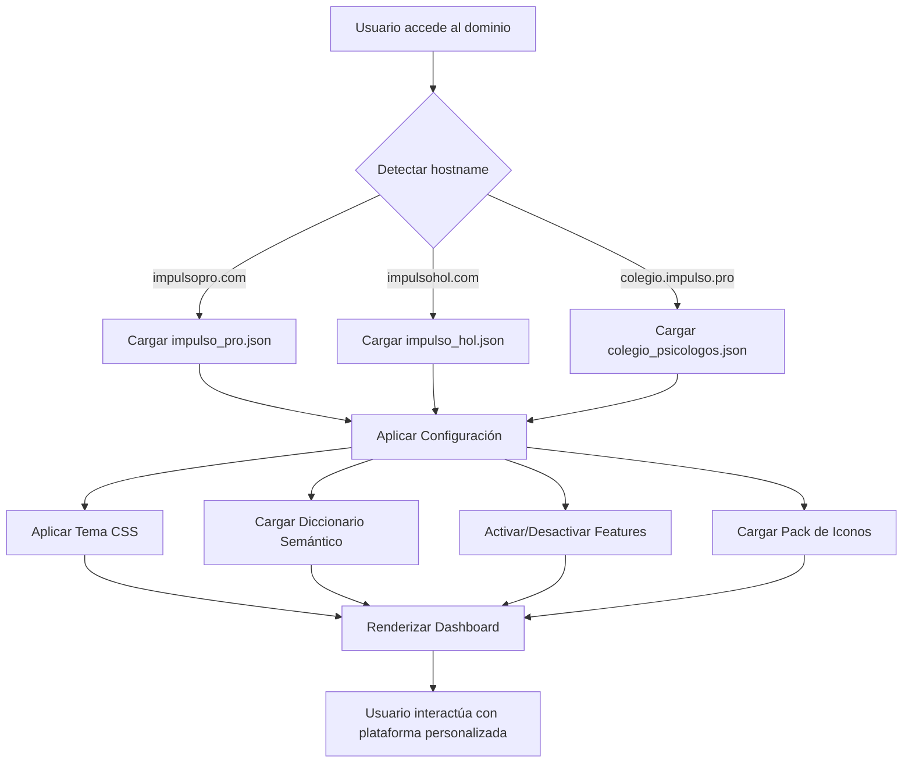

# ARQUITECTURA TÉCNICA - SISTEMA MULTI-TENANT WHITELABEL

**Versión:** 1.0
**Fecha:** 14 de Noviembre de 2025
**Responsable:** Devito (Arquitecto Técnico)
**Estado:** Fase 1 - MVP en Desarrollo

---

## 📋 TABLA DE CONTENIDOS

1. [Visión General](#visión-general)
2. [Decisiones Arquitectónicas](#decisiones-arquitectónicas)
3. [Diagrama de Bloques](#diagrama-de-bloques)
4. [Sistema de Configuración](#sistema-de-configuración)
5. [Flujo de Usuario](#flujo-de-usuario)
6. [Estructura de Archivos](#estructura-de-archivos)
7. [Roadmap de Implementación](#roadmap-de-implementación)

---

## 🎯 VISIÓN GENERAL

### Concepto Central: "La Fábrica de Plataformas"

No estamos construyendo UN producto SaaS.
Estamos construyendo una **Fábrica que genera múltiples productos SaaS** a partir de un único motor.

### Productos Actuales (Mellizos):

1. **Impulso Pro** - Para profesionales basados en Metodología (Psicólogos, Abogados, Consultores)
2. **Impulso Hol** - Para profesionales basados en Intuición (Astrólogos, Terapeutas Holísticos, Tarotistas)

### Productos Futuros (Extensiones B2B):

3. **Instancias Institucionales** - White-label total para Colegios, Escuelas, Asociaciones
   - Ejemplo: `colegiopsicologos.impulso.pro`
   - Ejemplo: `escuelaastrologia.impulso.pro`

---

## 🏗️ DECISIONES ARQUITECTÓNICAS

### ✅ DECISIÓN 1: Multi-Tenant con Base de Datos Compartida

**Estrategia:** Un solo código base, una sola base de datos, múltiples inquilinos (`tenant_id`).

**Razón:**
- Escalabilidad: Soportar 1, 10 o 1000 instancias sin duplicar infraestructura
- Mantenimiento: Una sola actualización se propaga a todos los tenants
- Costes: COGS ≈ 0 (Arquitectura Lean del DM1)

**Implementación:**
```sql
-- Todas las tablas llevan tenant_id
CREATE TABLE users (
  id SERIAL PRIMARY KEY,
  tenant_id VARCHAR(50) NOT NULL,  -- 'impulso_pro', 'impulso_hol', 'colegio_psicologos'
  email VARCHAR(255),
  name VARCHAR(255),
  professional_type VARCHAR(50),   -- 'clinical', 'mystic', 'neutral'
  ...
);

-- Row Level Security (RLS) garantiza aislamiento
ALTER TABLE users ENABLE ROW LEVEL SECURITY;
CREATE POLICY tenant_isolation ON users
  USING (tenant_id = current_setting('app.current_tenant'));
```

---

### ✅ DECISIÓN 2: Configuración Dinámica por Fases

**Fase 1 (MVP - Actual):**
- Archivos JSON estáticos en `/config/tenants/`
- Cambios requieren re-deploy (aceptable para MVP)
- Rápido de implementar

**Fase 2 (Producción - 4-6 semanas):**
- Configuración en Base de Datos
- Dashboard de administración para cambios en caliente
- Sin re-deploys

**Estructura JSON (MVP):**
```json
// /config/tenants/impulso_pro.json
{
  "tenant_id": "impulso_pro",
  "domain": "impulsopro.com",
  "brand": {
    "name": "Impulso Pro",
    "tagline": "La plataforma que estructura tu práctica profesional",
    "logo_url": "/assets/logos/impulso-pro.svg",
    "favicon": "/assets/favicons/impulso-pro.ico"
  },
  "theme": {
    "primary_color": "#003d82",
    "secondary_color": "#6B9080",
    "bg_light": "#f9f9f9",
    "text_color": "#333333",
    "font_primary": "Poppins",
    "font_secondary": "Lora"
  },
  "dictionary": {
    "client_term": "Clientes",
    "client_term_alt": "Pacientes",
    "session_term": "Sesión",
    "service_term": "Servicio",
    "booking_term": "Agendar Cita"
  },
  "features": {
    "carta_astral": false,
    "facturacion_avanzada": true,
    "membresia": true,
    "area_miembros": true,
    "eventos_vivo": true,
    "cursos_online": true
  },
  "icon_pack": "corporate",
  "professional_type": "clinical"
}
```

```json
// /config/tenants/impulso_hol.json
{
  "tenant_id": "impulso_hol",
  "domain": "impulsohol.com",
  "brand": {
    "name": "Impulso Holístico",
    "tagline": "Tu magia merece un espacio propio",
    "logo_url": "/assets/logos/impulso-hol.svg",
    "favicon": "/assets/favicons/impulso-hol.ico"
  },
  "theme": {
    "primary_color": "#7B68A6",
    "secondary_color": "#D4AF37",
    "bg_light": "#f5f3f8",
    "text_color": "#4a4a4a",
    "font_primary": "Lora",
    "font_secondary": "Poppins"
  },
  "dictionary": {
    "client_term": "Consultantes",
    "client_term_alt": "Almas",
    "session_term": "Consulta",
    "service_term": "Experiencia",
    "booking_term": "Reservar Espacio"
  },
  "features": {
    "carta_astral": true,
    "facturacion_avanzada": false,
    "membresia": true,
    "area_miembros": true,
    "eventos_vivo": true,
    "cursos_online": true
  },
  "icon_pack": "mystic",
  "professional_type": "mystic"
}
```

---

### ✅ DECISIÓN 3: Asignación de Tenant por Dominio

**Estrategia:** El dominio de entrada determina automáticamente el tenant.

**Flujo:**
1. Usuario accede a `impulsopro.com` → Se carga automáticamente `config/tenants/impulso_pro.json`
2. Usuario accede a `impulsohol.com` → Se carga automáticamente `config/tenants/impulso_hol.json`
3. Usuario accede a `colegiopsicologos.impulso.pro` → Se carga `config/tenants/colegio_psicologos.json`

**Implementación (JavaScript):**
```javascript
// /js/config-loader.js

async function loadTenantConfig() {
  const hostname = window.location.hostname;

  // Mapeo de dominios a tenant_id
  const tenantMap = {
    'impulsopro.com': 'impulso_pro',
    'www.impulsopro.com': 'impulso_pro',
    'impulsohol.com': 'impulso_hol',
    'www.impulsohol.com': 'impulso_hol',
    'colegiopsicologos.impulso.pro': 'colegio_psicologos'
  };

  const tenantId = tenantMap[hostname] || 'impulso_pro'; // Default fallback

  // Cargar configuración del tenant
  const response = await fetch(`/config/tenants/${tenantId}.json`);
  const config = await response.json();

  // Aplicar configuración globalmente
  window.TENANT_CONFIG = config;
  applyTheme(config.theme);
  applyDictionary(config.dictionary);
  applyFeatures(config.features);

  return config;
}

function applyTheme(theme) {
  const root = document.documentElement;
  root.style.setProperty('--color-primary', theme.primary_color);
  root.style.setProperty('--color-secondary', theme.secondary_color);
  root.style.setProperty('--color-bg-neutral', theme.bg_light);
  root.style.setProperty('--color-text', theme.text_color);
  // ... más variables CSS
}

function applyDictionary(dictionary) {
  // Reemplazar todos los {{client_term}} en el DOM
  document.body.innerHTML = document.body.innerHTML
    .replace(/\{\{client_term\}\}/g, dictionary.client_term)
    .replace(/\{\{session_term\}\}/g, dictionary.session_term)
    .replace(/\{\{service_term\}\}/g, dictionary.service_term);
}

function applyFeatures(features) {
  // Ocultar/mostrar módulos según feature flags
  if (!features.carta_astral) {
    document.querySelectorAll('[data-feature="carta_astral"]').forEach(el => {
      el.style.display = 'none';
    });
  }
  // ... más feature flags
}

// Ejecutar al cargar la página
document.addEventListener('DOMContentLoaded', loadTenantConfig);
```

---

## 📊 DIAGRAMA DE BLOQUES



---

## 🗂️ SISTEMA DE CONFIGURACIÓN

### Estructura de Directorios:

```
Web_modelo/
├── config/
│   └── tenants/
│       ├── impulso_pro.json
│       ├── impulso_hol.json
│       └── colegio_psicologos.json (futuro)
├── assets/
│   ├── logos/
│   │   ├── impulso-pro.svg
│   │   └── impulso-hol.svg
│   ├── icons/
│   │   ├── corporate/
│   │   │   ├── calendar.svg
│   │   │   ├── user.svg
│   │   │   └── success.svg
│   │   └── mystic/
│   │       ├── moon.svg
│   │       ├── star.svg
│   │       └── energy.svg
│   └── favicons/
│       ├── impulso-pro.ico
│       └── impulso-hol.ico
├── js/
│   ├── config-loader.js (NUEVO)
│   ├── tenant-manager.js (NUEVO)
│   └── main.js
└── css/
    └── styles.css (variables CSS dinámicas)
```

---

## 👤 FLUJO DE USUARIO

### Escenario 1: Usuario PRO (Psicólogo)

1. Accede a `impulsopro.com`
2. Se carga `impulso_pro.json`
3. Ve Galería de Estilos **Corporativos** (Azul, Gris, Verde)
4. Selecciona "Estilo Azul Profesional"
5. Se registra → `professional_type = 'clinical'`, `tenant_id = 'impulso_pro'`
6. Entra al Dashboard:
   - Colores: Azul corporativo (#003d82)
   - Iconos: Set "Corporate" (calendario cuadrado, gráficos)
   - Textos: "Gestiona tus **Pacientes**"
   - Features: Facturación Avanzada ✅, Carta Astral ❌

### Escenario 2: Usuario HOL (Astrólogo)

1. Accede a `impulsohol.com`
2. Se carga `impulso_hol.json`
3. Ve Galería de Estilos **Místicos** (Morado, Dorado, Tierra)
4. Selecciona "Estilo Morado Místico"
5. Se registra → `professional_type = 'mystic'`, `tenant_id = 'impulso_hol'`
6. Entra al Dashboard:
   - Colores: Morado místico (#7B68A6)
   - Iconos: Set "Mystic" (luna, estrellas, energía)
   - Textos: "Gestiona tus **Consultantes**"
   - Features: Carta Astral ✅, Facturación Avanzada ❌

### Escenario 3: Colegio de Psicólogos (B2B)

1. Accede a `colegiopsicologos.impulso.pro`
2. Se carga `colegio_psicologos.json`
3. Ve landing page con logo del Colegio
4. Profesionales colegiados se registran con código especial
5. Entra al Dashboard:
   - Colores: Azul institucional del Colegio
   - Logo: Escudo oficial del Colegio
   - Textos: "Plataforma Oficial - Colegio de Psicólogos"
   - Features: Solo módulos aprobados por el Colegio

---

## 🏗️ ROADMAP DE IMPLEMENTACIÓN

### 📅 FASE 1 - MVP (2-3 semanas) - ACTUAL

**Objetivo:** Motor Whitelabel funcionando con cambios de JSON reflejados en tiempo real.

#### Semana 1:
- [x] Documentación ARQUITECTURA-TECNICA.md
- [ ] Crear estructura `/config/tenants/`
- [ ] Implementar `config-loader.js`
- [ ] Crear 2 configuraciones JSON (impulso_pro, impulso_hol)
- [ ] Sistema de aplicación dinámica de CSS (applyTheme)

#### Semana 2:
- [ ] Diccionario semántico (applyDictionary)
- [ ] Sistema de Feature Flags (applyFeatures)
- [ ] Pack de iconos "Corporate" (6 iconos SVG básicos)
- [ ] Pack de iconos "Mystic" (6 iconos SVG básicos)

#### Semana 3:
- [ ] Galería de Estilos para Impulso Pro (3 variantes: Azul, Gris, Verde)
- [ ] Dashboard base neutro que se colorea según tenant
- [ ] Testing: Cambiar JSON y verificar cambios visuales
- [ ] Demo al Fundador

---

### 📅 FASE 2 - Producción (4-6 semanas)

- [ ] Migrar configuración de JSON a Base de Datos
- [ ] Dashboard de administración para cambiar configs sin re-deploy
- [ ] Sistema de temas avanzado (layouts diferentes, no solo colores)
- [ ] Galería de Estilos ampliada (6-9 demos por tenant)
- [ ] Multi-tenant real con RLS en PostgreSQL
- [ ] Sistema de subdominios dinámicos

---

### 📅 FASE 3 - B2B Enterprise (2-3 meses)

- [ ] White-label total para instituciones
- [ ] SSO (Single Sign-On) para Colegios
- [ ] API pública para integraciones
- [ ] Sistema de facturación por tenant
- [ ] Dashboard de métricas por tenant
- [ ] Onboarding automatizado para nuevos tenants

---

## 🔒 SEGURIDAD Y AISLAMIENTO

### Principios de Seguridad:

1. **Row Level Security (RLS):** Cada query SQL filtra automáticamente por `tenant_id`
2. **Session Isolation:** El `tenant_id` se almacena en la sesión del usuario al login
3. **API Validation:** Todos los endpoints validan que el usuario pertenece al tenant solicitado
4. **Asset Isolation:** Cada tenant solo puede acceder a sus propios assets (logos, archivos)

### Ejemplo de Middleware (Node.js/Express):

```javascript
// middleware/tenant-isolation.js

function setTenantContext(req, res, next) {
  const hostname = req.hostname;
  const tenantId = mapHostnameToTenant(hostname);

  // Establecer tenant_id en la sesión
  req.session.tenant_id = tenantId;

  // Establecer en contexto de base de datos
  req.db.query(`SET app.current_tenant = '${tenantId}'`);

  next();
}

// Aplicar a todas las rutas
app.use(setTenantContext);
```

---

## 📝 NOTAS TÉCNICAS

### Variables CSS Dinámicas (ya implementadas):

El sistema whitelabel del DM1 ya tiene 27 variables CSS en `/css/styles.css` (líneas 2283-2315).
El `config-loader.js` simplemente las **sobrescribe** con los valores del JSON.

```css
/* styles.css - Variables que se sobrescriben dinámicamente */
:root {
  --color-primary: #c5d9e8;  /* Será sobrescrito por config.theme.primary_color */
  --color-secondary: #e8d5c4; /* Será sobrescrito por config.theme.secondary_color */
  /* ... */
}
```

### Compatibilidad:

- **Navegadores:** Chrome 90+, Firefox 88+, Safari 14+, Edge 90+
- **JavaScript:** ES6+ (async/await, fetch API)
- **CSS:** Variables CSS nativas (no requiere preprocesador)

---

## 🚀 SIGUIENTE PASO INMEDIATO

**ACCIÓN:** Crear la estructura `/config/tenants/` e implementar `config-loader.js`.

**ETA:** 2-3 días.

**Bloqueos:** Ninguno. Puedo empezar ya.

---

**Documentado por:** Devito
**Aprobado por:** Fundador (Decisión de Arquitectura Multi-Tenant)
**Fecha:** 14 de Noviembre de 2025
**Versión:** 1.0 - MVP Fase 1
